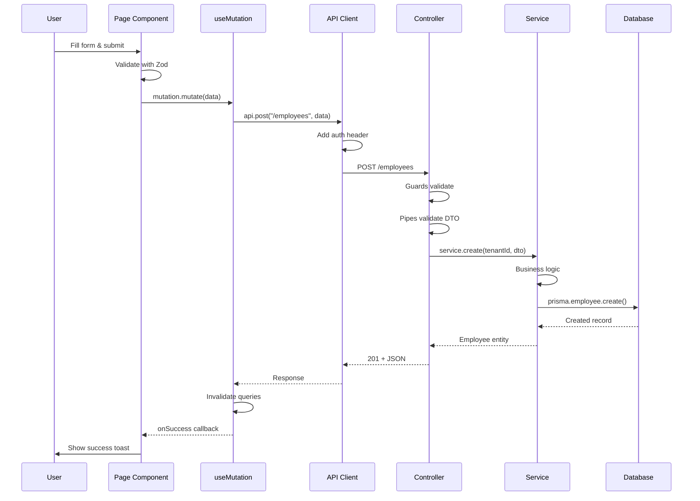
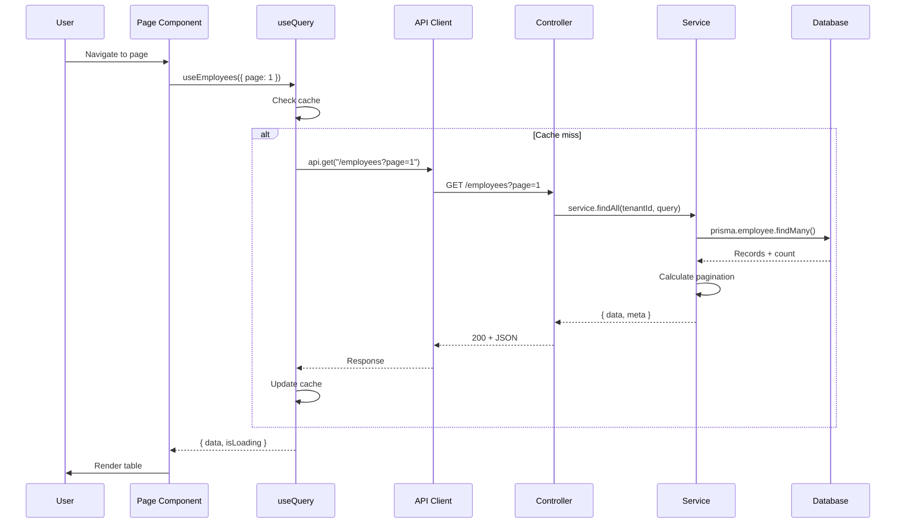
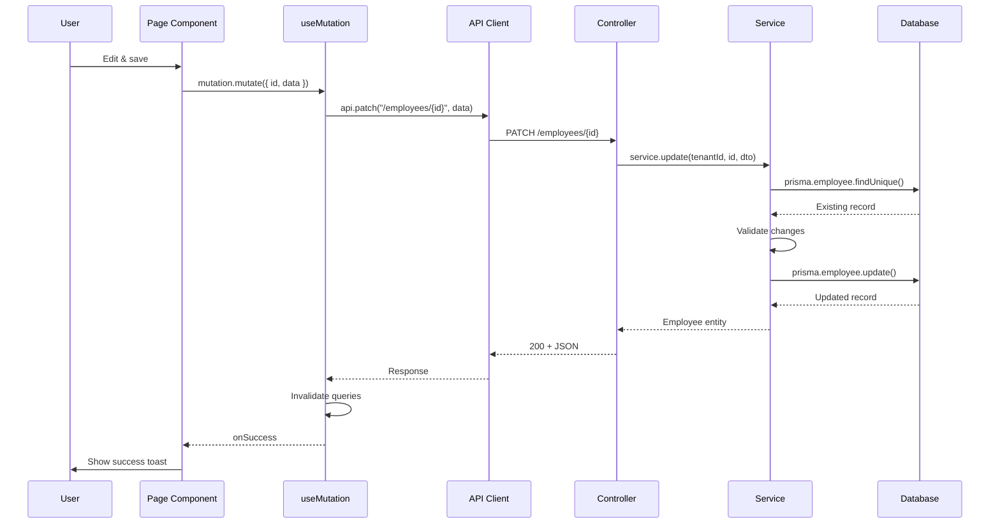
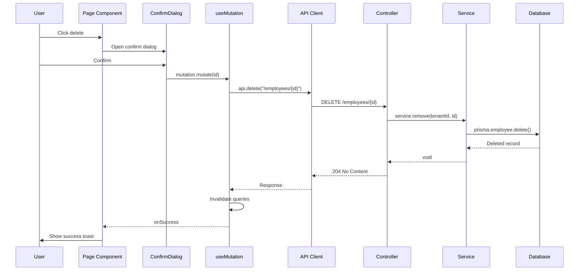

# Data Flow Documentation

> How data moves through the PPMS system - from user action to database and back

## Overview

```
┌──────────┐    ┌──────────┐    ┌──────────┐    ┌──────────┐    ┌──────────┐
│  User    │ -> │ Frontend │ -> │   API    │ -> │ Service  │ -> │ Database │
│  Action  │    │  React   │    │  NestJS  │    │  Layer   │    │ Postgres │
└──────────┘    └──────────┘    └──────────┘    └──────────┘    └──────────┘
                     │                │               │               │
                     │  TanStack      │  Guards       │  Prisma       │
                     │  Query         │  Pipes        │  Client       │
                     │  Mutations     │  Interceptors │               │
                     └────────────────┴───────────────┴───────────────┘
```

---

## Frontend Data Flow

### 1. User Action -> API Call

```
┌─────────────────────────────────────────────────────────────────────────┐
│                           FRONTEND FLOW                                  │
│                                                                          │
│  ┌──────────────┐                                                        │
│  │  User clicks │                                                        │
│  │  "Save" btn  │                                                        │
│  └──────┬───────┘                                                        │
│         │                                                                │
│         ▼                                                                │
│  ┌──────────────────────────────────────────────────────────────────┐   │
│  │  Page Component (e.g., EmployeeFormPage.tsx)                     │   │
│  │                                                                  │   │
│  │  const mutation = useCreateEmployee();                           │   │
│  │  mutation.mutate(formData);                                      │   │
│  └──────────────────────────────────────────────────────────────────┘   │
│         │                                                                │
│         ▼                                                                │
│  ┌──────────────────────────────────────────────────────────────────┐   │
│  │  Mutation Hook (employees.mutations.ts)                          │   │
│  │                                                                  │   │
│  │  export const useCreateEmployee = () => {                        │   │
│  │    return useMutation({                                          │   │
│  │      mutationFn: employeesApi.create,                            │   │
│  │      onSuccess: () => queryClient.invalidateQueries()            │   │
│  │    });                                                           │   │
│  │  };                                                              │   │
│  └──────────────────────────────────────────────────────────────────┘   │
│         │                                                                │
│         ▼                                                                │
│  ┌──────────────────────────────────────────────────────────────────┐   │
│  │  API Function (employees.api.ts)                                 │   │
│  │                                                                  │   │
│  │  export const employeesApi = {                                   │   │
│  │    create: (data: CreateEmployeeDto) =>                          │   │
│  │      api.post<Employee>("/employees", data)                      │   │
│  │  };                                                              │   │
│  └──────────────────────────────────────────────────────────────────┘   │
│         │                                                                │
│         ▼                                                                │
│  ┌──────────────────────────────────────────────────────────────────┐   │
│  │  API Client (lib/api-client.ts)                                  │   │
│  │                                                                  │   │
│  │  - Adds Authorization header                                     │   │
│  │  - Handles 401 -> refresh token                                  │   │
│  │  - Handles errors globally                                       │   │
│  └──────────────────────────────────────────────────────────────────┘   │
│         │                                                                │
│         │ HTTP POST /api/employees                                       │
│         ▼                                                                │
│  ┌──────────────────────────────────────────────────────────────────┐   │
│  │                         BACKEND                                  │   │
│  └──────────────────────────────────────────────────────────────────┘   │
└─────────────────────────────────────────────────────────────────────────┘
```

### 2. Data Fetching (useQuery)

```
┌─────────────────────────────────────────────────────────────────────────┐
│                         QUERY FLOW                                       │
│                                                                          │
│  ┌──────────────┐                                                        │
│  │  Component   │                                                        │
│  │  Mounts      │                                                        │
│  └──────┬───────┘                                                        │
│         │                                                                │
│         ▼                                                                │
│  ┌──────────────────────────────────────────────────────────────────┐   │
│  │  const { data, isLoading } = useEmployees(params);               │   │
│  └──────────────────────────────────────────────────────────────────┘   │
│         │                                                                │
│         ▼                                                                │
│  ┌──────────────────────────────────────────────────────────────────┐   │
│  │  TanStack Query checks cache                                     │   │
│  │                                                                  │   │
│  │  Cache HIT?  ─────> Return cached data immediately               │   │
│  │       │              (may refetch in background)                 │   │
│  │       │                                                          │   │
│  │  Cache MISS? ─────> Fetch from API                               │   │
│  └──────────────────────────────────────────────────────────────────┘   │
│         │                                                                │
│         ▼                                                                │
│  ┌──────────────────────────────────────────────────────────────────┐   │
│  │  employeesApi.getAll(params) -> HTTP GET /employees?page=1       │   │
│  └──────────────────────────────────────────────────────────────────┘   │
│         │                                                                │
│         ▼                                                                │
│  ┌──────────────────────────────────────────────────────────────────┐   │
│  │  Response received -> Cache updated -> Component re-renders      │   │
│  └──────────────────────────────────────────────────────────────────┘   │
└─────────────────────────────────────────────────────────────────────────┘
```

---

## Backend Data Flow

### 3. Request Processing Pipeline

```
┌─────────────────────────────────────────────────────────────────────────┐
│                         BACKEND FLOW                                     │
│                                                                          │
│  ┌──────────────────────────────────────────────────────────────────┐   │
│  │  HTTP Request: POST /employees                                   │   │
│  │  Headers: Authorization: Bearer {jwt}                            │   │
│  │  Body: { firstName: "John", ... }                                │   │
│  └──────────────────────────────────────────────────────────────────┘   │
│         │                                                                │
│         ▼                                                                │
│  ┌──────────────────────────────────────────────────────────────────┐   │
│  │  1. MIDDLEWARE                                                   │   │
│  │     - TenantMiddleware: Extract tenant from JWT                  │   │
│  │     - LoggingMiddleware: Log request details                     │   │
│  └──────────────────────────────────────────────────────────────────┘   │
│         │                                                                │
│         ▼                                                                │
│  ┌──────────────────────────────────────────────────────────────────┐   │
│  │  2. GUARDS (in order)                                            │   │
│  │     - JwtAuthGuard: Validate JWT, extract user                   │   │
│  │     - RolesGuard: Check user has required role                   │   │
│  │     - PermissionsGuard: Check user has permission                │   │
│  │     - TenantGuard: Verify tenant access                          │   │
│  │                                                                  │   │
│  │     FAIL? -> Return 401/403                                      │   │
│  └──────────────────────────────────────────────────────────────────┘   │
│         │                                                                │
│         ▼                                                                │
│  ┌──────────────────────────────────────────────────────────────────┐   │
│  │  3. PIPES                                                        │   │
│  │     - ValidationPipe: Validate DTO with class-validator          │   │
│  │     - Transform data types                                       │   │
│  │                                                                  │   │
│  │     INVALID? -> Return 400 Bad Request                           │   │
│  └──────────────────────────────────────────────────────────────────┘   │
│         │                                                                │
│         ▼                                                                │
│  ┌──────────────────────────────────────────────────────────────────┐   │
│  │  4. CONTROLLER                                                   │   │
│  │     employees.controller.ts                                      │   │
│  │                                                                  │   │
│  │     @Post()                                                      │   │
│  │     create(                                                      │   │
│  │       @Body() dto: CreateEmployeeDto,                            │   │
│  │       @CurrentTenant() tenantId: string,                         │   │
│  │       @CurrentUser() user: User                                  │   │
│  │     ) {                                                          │   │
│  │       return this.employeesService.create(tenantId, dto, user);  │   │
│  │     }                                                            │   │
│  └──────────────────────────────────────────────────────────────────┘   │
│         │                                                                │
│         ▼                                                                │
│  ┌──────────────────────────────────────────────────────────────────┐   │
│  │  5. SERVICE                                                      │   │
│  │     employees.service.ts                                         │   │
│  │                                                                  │   │
│  │     - Business logic                                             │   │
│  │     - Validation rules                                           │   │
│  │     - Generate employee ID                                       │   │
│  │     - Call Prisma                                                │   │
│  └──────────────────────────────────────────────────────────────────┘   │
│         │                                                                │
│         ▼                                                                │
│  ┌──────────────────────────────────────────────────────────────────┐   │
│  │  6. PRISMA SERVICE                                               │   │
│  │     prisma.service.ts                                            │   │
│  │                                                                  │   │
│  │     this.prisma.employee.create({                                │   │
│  │       data: { ...dto, tenantId }                                 │   │
│  │     });                                                          │   │
│  └──────────────────────────────────────────────────────────────────┘   │
│         │                                                                │
│         ▼                                                                │
│  ┌──────────────────────────────────────────────────────────────────┐   │
│  │  7. DATABASE                                                     │   │
│  │     PostgreSQL                                                   │   │
│  │                                                                  │   │
│  │     INSERT INTO "Employee" (...) VALUES (...) RETURNING *;       │   │
│  └──────────────────────────────────────────────────────────────────┘   │
│         │                                                                │
│         ▼                                                                │
│  ┌──────────────────────────────────────────────────────────────────┐   │
│  │  8. INTERCEPTORS (on response)                                   │   │
│  │     - TransformInterceptor: Format response                      │   │
│  │     - AuditLogInterceptor: Log action                            │   │
│  └──────────────────────────────────────────────────────────────────┘   │
│         │                                                                │
│         ▼                                                                │
│  ┌──────────────────────────────────────────────────────────────────┐   │
│  │  HTTP Response: 201 Created                                      │   │
│  │  Body: { id: "uuid", employeeId: "FPC-0001-25", ... }            │   │
│  └──────────────────────────────────────────────────────────────────┘   │
└─────────────────────────────────────────────────────────────────────────┘
```

---

## CRUD Operations Flow

### Create Operation



### Read Operation (List)



### Update Operation



### Delete Operation



---

## Authentication Flow

### Login

```
┌──────────┐                    ┌──────────┐                    ┌──────────┐
│  Login   │  POST /auth/login  │  Auth    │  Validate & JWT   │  User    │
│  Page    │ ────────────────▶  │  Service │ ────────────────▶ │  Table   │
└──────────┘  { username, pwd } └──────────┘                    └──────────┘
     ▲                               │
     │                               │ { accessToken, refreshToken }
     │                               ▼
     │                          ┌──────────┐
     │                          │ Response │
     │◀──────────────────────── │ to Client│
     │                          └──────────┘
     │
     ▼
┌──────────┐
│  Store   │
│  tokens  │
│  in      │
│ localStorage
└──────────┘
```

### Token Refresh

```
┌──────────┐                    ┌──────────┐                    ┌──────────┐
│  API     │  401 Unauthorized  │  Auth    │  POST /auth/refresh│  Refresh │
│  Client  │ ◀─────────────────│  Service │ ────────────────▶  │  Token   │
└──────────┘                    └──────────┘                    │  Table   │
     │                               ▲                          └──────────┘
     │ Intercept 401                 │
     ▼                               │ New tokens
┌──────────┐                         │
│  Retry   │ ────────────────────────┘
│  Original│
│  Request │
└──────────┘
```

---

## Multi-Tenant Data Flow

### Every Request Must Include Tenant

```
┌─────────────────────────────────────────────────────────────────────────┐
│                     TENANT ISOLATION                                     │
│                                                                          │
│  1. JWT Token contains tenantId                                          │
│     { sub: "user-1", tenantId: "tenant-1", ... }                        │
│                                                                          │
│  2. @CurrentTenant() decorator extracts from JWT                         │
│     create(@CurrentTenant() tenantId: string)                            │
│                                                                          │
│  3. Service ALWAYS includes tenantId in queries                          │
│     this.prisma.employee.findMany({                                      │
│       where: { tenantId }  // ALWAYS REQUIRED                            │
│     })                                                                   │
│                                                                          │
│  4. Database enforces with foreign key                                   │
│     tenantId -> Tenant.id                                                │
└─────────────────────────────────────────────────────────────────────────┘
```

---

## File Upload Flow

### Photo Upload Example

```
┌──────────┐   ┌──────────┐   ┌──────────┐   ┌──────────┐   ┌──────────┐
│  User    │   │  Form    │   │  API     │   │  Multer  │   │  File    │
│  Selects │──▶│  Data    │──▶│  Client  │──▶│  Parse   │──▶│  System  │
│  File    │   │  + File  │   │  FormData│   │  File    │   │  Save    │
└──────────┘   └──────────┘   └──────────┘   └──────────┘   └──────────┘
                                                                  │
                                                                  ▼
┌──────────┐   ┌──────────┐   ┌──────────┐   ┌──────────┐   ┌──────────┐
│  Return  │◀──│  Create  │◀──│  Hash    │◀──│  Validate│◀──│  File    │
│  Photo   │   │  DB      │   │  File    │   │  Type/   │   │  Path    │
│  Record  │   │  Record  │   │  SHA-256 │   │  Size    │   │          │
└──────────┘   └──────────┘   └──────────┘   └──────────┘   └──────────┘
```

---

## Cache Invalidation Strategy

### TanStack Query Keys

```typescript
// Query keys follow pattern: [module, action, params]
["employees", "list", { page: 1, search: "" }]
["employees", "detail", "employee-uuid"]
["departments", "list", { centerId: "center-uuid" }]

// Invalidation after mutations
queryClient.invalidateQueries({ queryKey: ["employees"] }); // All employee queries
queryClient.invalidateQueries({ queryKey: ["employees", "list"] }); // Only lists
```

### When to Invalidate

| Action | Invalidate |
|--------|------------|
| Create employee | `["employees", "list"]`, `["dashboard"]` |
| Update employee | `["employees", "detail", id]`, `["employees", "list"]` |
| Delete employee | `["employees", "list"]` |
| Transfer employee | `["employees"]`, `["transfers"]`, `["centers"]` |

---

## Error Handling Flow

### Backend Errors

```
┌──────────┐                    ┌──────────┐                    ┌──────────┐
│  Service │  throw new         │  Exception│  Transform to    │  Client  │
│  Error   │ ──────────────────▶│  Filter   │ ──────────────▶  │  Gets    │
└──────────┘  BadRequestException└──────────┘  JSON response    └──────────┘
                                                                     │
                                                                     ▼
                                                              ┌──────────────┐
                                                              │ {            │
                                                              │   statusCode │
                                                              │   message    │
                                                              │   error      │
                                                              │ }            │
                                                              └──────────────┘
```

### Frontend Error Handling

```
┌──────────┐                    ┌──────────┐                    ┌──────────┐
│  API     │  Axios intercepts  │  Error   │  Show toast /     │  User    │
│  Error   │ ──────────────────▶│  Handler │ ──────────────▶   │  Sees    │
└──────────┘                    └──────────┘  redirect          └──────────┘
     │
     │ 401? -> Refresh token or redirect to login
     │ 403? -> Show permission denied
     │ 404? -> Show not found
     │ 500? -> Show generic error
```

---

## Related Documentation

- [STATE-MACHINES.md](./STATE-MACHINES.md) - Workflow state diagrams
- [API-REFERENCE.md](../reference/API-REFERENCE.md) - All API endpoints
- [SYSTEM-OVERVIEW.md](./SYSTEM-OVERVIEW.md) - Architecture overview

---

*Last Updated: 2025-01-18*
