# State Machines & Workflow Diagrams

> Visual diagrams of all stateful workflows in PPMS

---

## Employee Status Workflow

### Employee Status States

```text
┌─────────────────────────────────────────────────────────────────────────┐
│                       EMPLOYEE STATUS WORKFLOW                           │
│                                                                          │
│                         ┌──────────┐                                     │
│                         │  ACTIVE  │ ◀───────────────────┐               │
│                         └────┬─────┘                     │               │
│                              │                           │               │
│           ┌──────────────────┼──────────────────┐        │               │
│           │                  │                  │        │               │
│           ▼                  ▼                  ▼        │               │
│     ┌──────────┐      ┌──────────┐       ┌──────────┐   │               │
│     │ ON_LEAVE │      │ SUSPENDED│       │ INACTIVE │   │               │
│     └────┬─────┘      └────┬─────┘       └────┬─────┘   │               │
│          │                 │                  │         │               │
│          │                 │                  │         │               │
│          └─────────────────┴──────────────────┴─────────┘               │
│                              │                                           │
│                              │ (Cannot return to ACTIVE)                 │
│                              ▼                                           │
│           ┌──────────────────┼──────────────────┐                        │
│           │                  │                  │                        │
│           ▼                  ▼                  ▼                        │
│     ┌──────────┐      ┌──────────┐       ┌──────────┐                   │
│     │ RETIRED  │      │TERMINATED│       │ DECEASED │                   │
│     └──────────┘      └──────────┘       └──────────┘                   │
│     (Final State)     (Final State)      (Final State)                  │
└─────────────────────────────────────────────────────────────────────────┘
```

### Mermaid Diagram

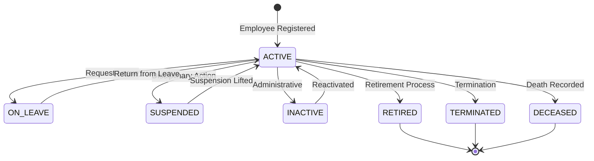

### Status Transitions Table

| From | To | Trigger | Roles |
|------|-----|---------|-------|
| ACTIVE | ON_LEAVE | Leave request approved | HR_OFFICER |
| ACTIVE | SUSPENDED | Disciplinary action | HR_DIRECTOR |
| ACTIVE | INACTIVE | Administrative decision | CENTER_ADMIN |
| ACTIVE | RETIRED | Retirement completed | HR_DIRECTOR |
| ACTIVE | TERMINATED | Employment ended | IT_ADMIN |
| ACTIVE | DECEASED | Death recorded | HR_OFFICER |
| ON_LEAVE | ACTIVE | Leave ended | HR_OFFICER |
| SUSPENDED | ACTIVE | Suspension lifted | HR_DIRECTOR |
| INACTIVE | ACTIVE | Reactivation | CENTER_ADMIN |

---

## Transfer Request Workflow

### Transfer Status States

```text
┌─────────────────────────────────────────────────────────────────────────┐
│                      TRANSFER REQUEST WORKFLOW                           │
│                                                                          │
│  Source Center                    Target Center                          │
│  ────────────                     ─────────────                          │
│                                                                          │
│  ┌──────────┐                                                            │
│  │ PENDING  │ ──────────────────────────────────────────┐                │
│  └────┬─────┘                                           │                │
│       │                                                 │                │
│       │ Transfer created                                │                │
│       │                                                 │                │
│       ▼                                                 │                │
│  ┌────────────────────────────────────────────────┐     │                │
│  │       Target Center Reviews Request            │     │                │
│  └────────────────────────────────────────────────┘     │                │
│       │                                                 │                │
│       ├─────────────────────┐                           │                │
│       │                     │                           │                │
│       ▼                     ▼                           │                │
│  ┌──────────┐         ┌──────────┐                ┌──────────┐          │
│  │ ACCEPTED │         │ REJECTED │                │CANCELLED │          │
│  └────┬─────┘         └──────────┘                └──────────┘          │
│       │               (Final State)               (Final State)         │
│       │                                                                  │
│       ▼                                                                  │
│  ┌────────────────────────────────────────────────┐                     │
│  │  - Employee moves to target center             │                     │
│  │  - Departure record created at source          │                     │
│  │  - Employee record updated                     │                     │
│  └────────────────────────────────────────────────┘                     │
└─────────────────────────────────────────────────────────────────────────┘
```

### Mermaid Diagram

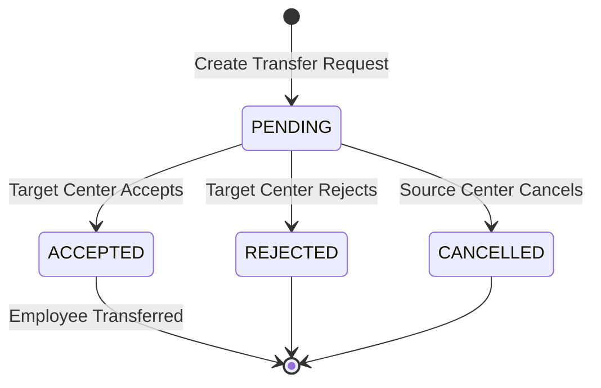

### Transfer Actions

| Status | Action | Actor | Effect |
|--------|--------|-------|--------|
| PENDING | Accept | Target Center Admin | Employee moves, departure record created |
| PENDING | Reject | Target Center Admin | Request closed, employee stays |
| PENDING | Cancel | Source Center Admin | Request withdrawn |

---

## Leave Request Workflow

### Leave Request States

```text
┌─────────────────────────────────────────────────────────────────────────┐
│                      LEAVE REQUEST WORKFLOW                              │
│                                                                          │
│       Employee                  Supervisor                HR             │
│       ────────                  ──────────                ──             │
│                                                                          │
│  ┌──────────┐                                                            │
│  │  DRAFT   │                                                            │
│  └────┬─────┘                                                            │
│       │ Submit                                                           │
│       ▼                                                                  │
│  ┌──────────┐                                                            │
│  │ PENDING  │ ──────────────────┬───────────────────┐                    │
│  └────┬─────┘                   │                   │                    │
│       │                         │                   │                    │
│       │                         ▼                   ▼                    │
│       │                   ┌──────────┐        ┌──────────┐               │
│       │                   │ APPROVED │        │ REJECTED │               │
│       │                   └──────────┘        └──────────┘               │
│       │                                                                  │
│       ▼                                                                  │
│  ┌──────────┐                                                            │
│  │CANCELLED │ (Employee cancels before decision)                         │
│  └──────────┘                                                            │
└─────────────────────────────────────────────────────────────────────────┘
```

### Mermaid Diagram

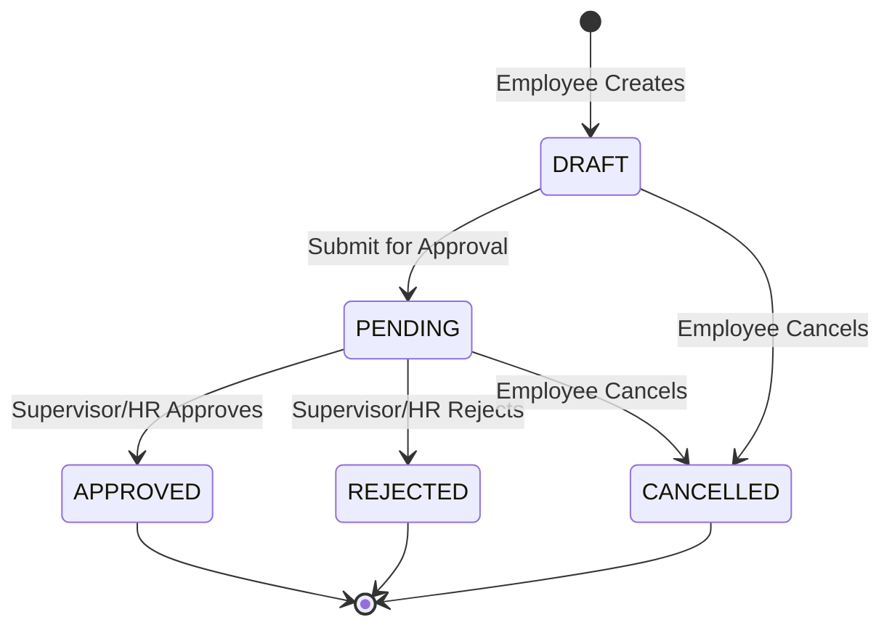

---

## Complaint Workflow

### Complaint Status States

```text
┌─────────────────────────────────────────────────────────────────────────┐
│                        COMPLAINT WORKFLOW                                │
│                                                                          │
│  ┌────────────┐                                                          │
│  │  SUBMITTED │                                                          │
│  └─────┬──────┘                                                          │
│        │ Assign to investigator                                          │
│        ▼                                                                 │
│  ┌────────────┐                                                          │
│  │UNDER_REVIEW│                                                          │
│  └─────┬──────┘                                                          │
│        │ Start investigation                                             │
│        ▼                                                                 │
│  ┌─────────────────┐                                                     │
│  │ INVESTIGATION   │                                                     │
│  │   IN_PROGRESS   │                                                     │
│  └───────┬─────────┘                                                     │
│          │                                                               │
│          ├─────────────────────┐                                         │
│          │                     │                                         │
│          ▼                     ▼                                         │
│  ┌──────────────┐       ┌──────────────┐                                 │
│  │ COMPLETED    │       │  SUSPENDED   │                                 │
│  │  _CLEARED    │       └──────────────┘                                 │
│  └──────────────┘                                                        │
│          │                                                               │
│          │                                                               │
│          ▼                                                               │
│  ┌──────────────┐                                                        │
│  │ COMPLETED    │                                                        │
│  │   _GUILTY    │                                                        │
│  └──────────────┘                                                        │
│          │                                                               │
│          │ Disciplinary action                                           │
│          ▼                                                               │
│  ┌──────────────┐                                                        │
│  │   RESOLVED   │                                                        │
│  └──────────────┘                                                        │
└─────────────────────────────────────────────────────────────────────────┘
```

### Mermaid Diagram

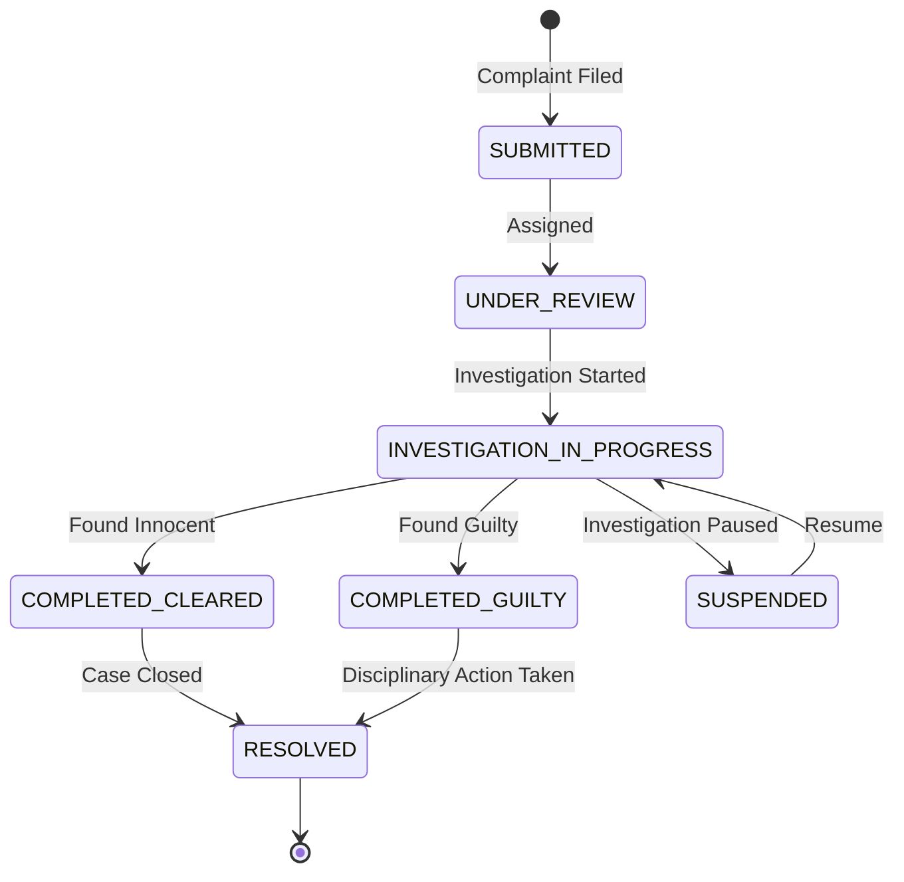

---

## Retirement Workflow

### Retirement Status States

```text
┌─────────────────────────────────────────────────────────────────────────┐
│                       RETIREMENT WORKFLOW                                │
│                                                                          │
│  ┌──────────┐                                                            │
│  │ PENDING  │  Retirement date approaching                               │
│  └────┬─────┘                                                            │
│       │                                                                  │
│       ▼                                                                  │
│  ┌─────────────┐                                                         │
│  │ IN_PROGRESS │  Processing started                                     │
│  └──────┬──────┘                                                         │
│         │                                                                │
│         ▼                                                                │
│  ┌─────────────┐                                                         │
│  │  CLEARANCE  │  Clearance process                                      │
│  └──────┬──────┘                                                         │
│         │                                                                │
│         ├──────────────────┐                                             │
│         │                  │                                             │
│         ▼                  ▼                                             │
│  ┌──────────────┐   ┌──────────────┐                                     │
│  │  COMPLETED   │   │  CANCELLED   │                                     │
│  └──────────────┘   └──────────────┘                                     │
│                                                                          │
│  Clearance Departments:                                                  │
│  - Finance (salary settlement)                                           │
│  - Inventory (equipment return)                                          │
│  - Weapons (weapon return)                                               │
│  - HR (documentation)                                                    │
└─────────────────────────────────────────────────────────────────────────┘
```

### Mermaid Diagram

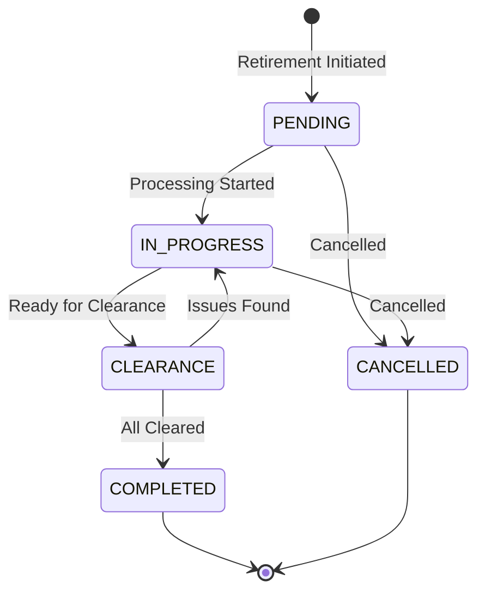

### Clearance Status per Department

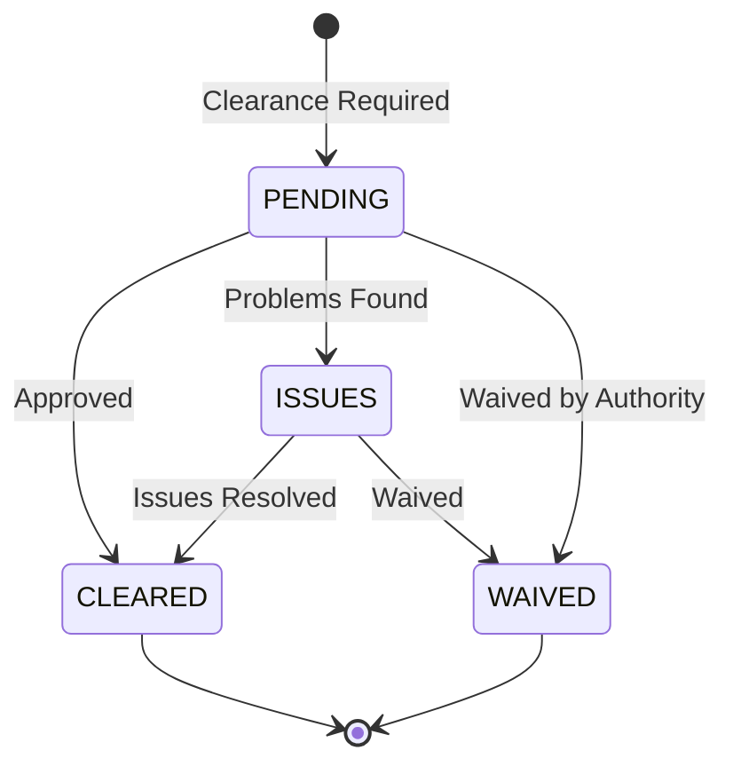

---

## Service Reward Workflow

### Service Reward States

```text
┌─────────────────────────────────────────────────────────────────────────┐
│                      SERVICE REWARD WORKFLOW                             │
│                                                                          │
│  System calculates eligibility based on:                                 │
│  - Years of service (5, 10, 15, 20, 25, 30)                             │
│  - No active Article 31 disciplinary                                     │
│  - Not under investigation                                               │
│                                                                          │
│  ┌──────────┐                                                            │
│  │ PENDING  │  System detected milestone                                 │
│  └────┬─────┘                                                            │
│       │                                                                  │
│       ├──────────────────┬──────────────────┐                            │
│       │                  │                  │                            │
│       ▼                  ▼                  ▼                            │
│  ┌──────────┐      ┌──────────┐      ┌───────────┐                       │
│  │ ELIGIBLE │      │INELIGIBLE│      │ POSTPONED │                       │
│  └────┬─────┘      └──────────┘      └─────┬─────┘                       │
│       │                                    │                             │
│       ▼                                    │                             │
│  ┌────────────────┐                        │                             │
│  │AWAITING_APPROVAL                        │                             │
│  └───────┬────────┘                        │                             │
│          │                                 │                             │
│          ├──────────────┐                  │                             │
│          │              │                  │                             │
│          ▼              ▼                  │                             │
│  ┌──────────┐     ┌──────────┐             │                             │
│  │ APPROVED │     │ REJECTED │             │                             │
│  └────┬─────┘     └──────────┘             │                             │
│       │                                    │                             │
│       ▼                                    │                             │
│  ┌──────────┐                              │                             │
│  │ AWARDED  │◀─────────────────────────────┘                             │
│  └──────────┘  (After investigation cleared)                             │
└─────────────────────────────────────────────────────────────────────────┘
```

### Mermaid Diagram

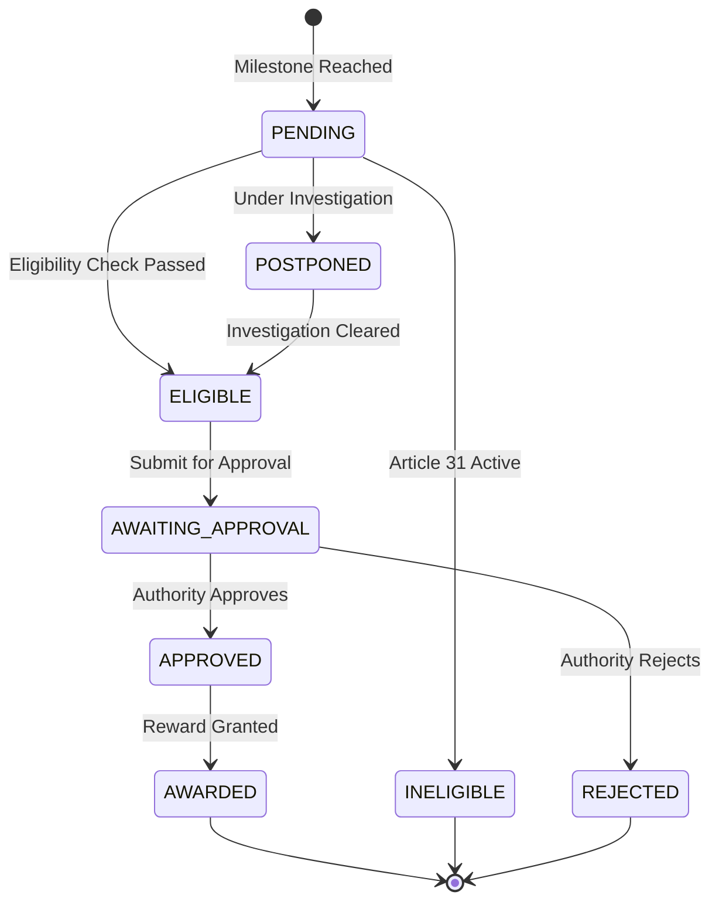

---

## Photo Approval Workflow

### Photo Status States

```text
┌─────────────────────────────────────────────────────────────────────────┐
│                       PHOTO APPROVAL WORKFLOW                            │
│                                                                          │
│  ┌──────────────────┐                                                    │
│  │ PENDING_APPROVAL │  Photo uploaded                                    │
│  └────────┬─────────┘                                                    │
│           │                                                              │
│           ├──────────────────┐                                           │
│           │                  │                                           │
│           ▼                  ▼                                           │
│     ┌──────────┐       ┌──────────┐                                      │
│     │ APPROVED │       │ REJECTED │                                      │
│     └────┬─────┘       └──────────┘                                      │
│          │                                                               │
│          ▼                                                               │
│     ┌──────────┐                                                         │
│     │  ACTIVE  │  Current profile photo                                  │
│     └────┬─────┘                                                         │
│          │                                                               │
│          ▼                                                               │
│     ┌──────────┐                                                         │
│     │ ARCHIVED │  Replaced by new photo                                  │
│     └──────────┘                                                         │
└─────────────────────────────────────────────────────────────────────────┘
```

### Mermaid Diagram

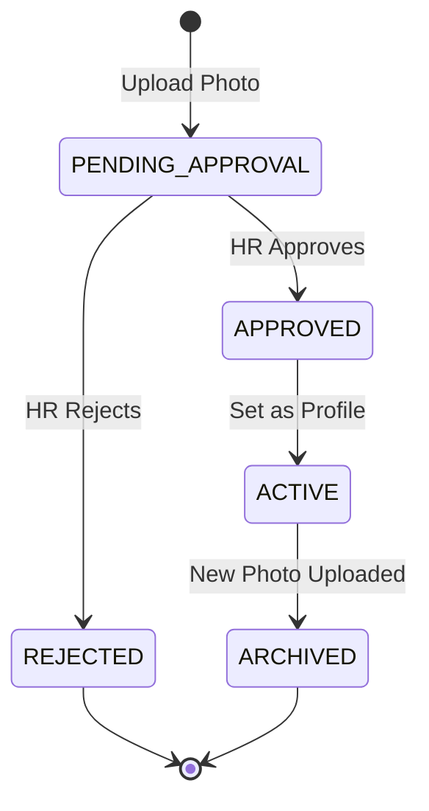

---

## Appraisal Workflow

### Appraisal Status States

```text
┌─────────────────────────────────────────────────────────────────────────┐
│                       APPRAISAL WORKFLOW                                 │
│                                                                          │
│  ┌──────────┐                                                            │
│  │  DRAFT   │  HR creates appraisal period                               │
│  └────┬─────┘                                                            │
│       │                                                                  │
│       ▼                                                                  │
│  ┌─────────────┐                                                         │
│  │ IN_PROGRESS │  Supervisors complete evaluations                       │
│  └──────┬──────┘                                                         │
│         │                                                                │
│         ▼                                                                │
│  ┌──────────┐                                                            │
│  │ SUBMITTED│  All evaluations submitted                                 │
│  └────┬─────┘                                                            │
│       │                                                                  │
│       ▼                                                                  │
│  ┌──────────┐                                                            │
│  │ REVIEWED │  Department heads review                                   │
│  └────┬─────┘                                                            │
│       │                                                                  │
│       ├──────────────────┐                                               │
│       │                  │                                               │
│       ▼                  ▼                                               │
│  ┌──────────┐      ┌──────────┐                                          │
│  │ APPROVED │      │ REJECTED │                                          │
│  └──────────┘      └────┬─────┘                                          │
│                         │                                                │
│                         ▼                                                │
│                   Back to IN_PROGRESS                                    │
└─────────────────────────────────────────────────────────────────────────┘
```

### Mermaid Diagram

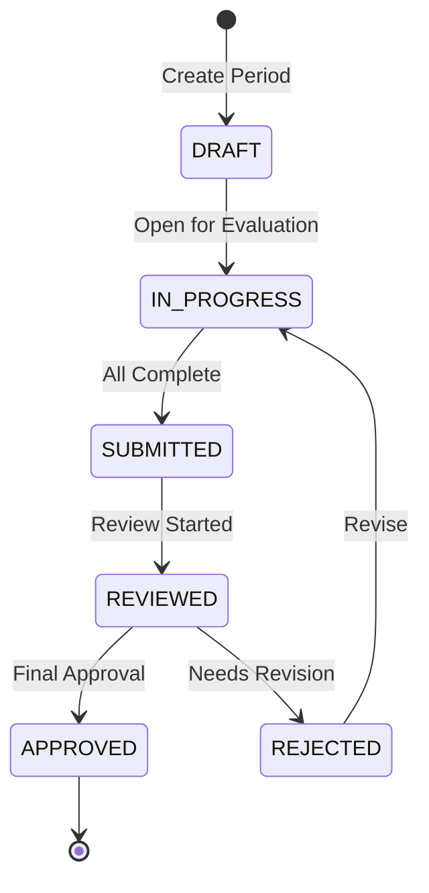

---

## User Account Workflow

### User Status States

```text
┌─────────────────────────────────────────────────────────────────────────┐
│                       USER ACCOUNT WORKFLOW                              │
│                                                                          │
│  ┌──────────┐                                                            │
│  │ PENDING  │  Account created (must change password)                    │
│  └────┬─────┘                                                            │
│       │                                                                  │
│       ▼                                                                  │
│  ┌──────────┐                                                            │
│  │  ACTIVE  │◀─────────────────────────────────┐                         │
│  └────┬─────┘                                  │                         │
│       │                                        │                         │
│       ├──────────────────┬─────────────────────┤                         │
│       │                  │                     │                         │
│       ▼                  ▼                     │                         │
│  ┌──────────┐      ┌──────────┐          ┌────┴─────┐                    │
│  │ INACTIVE │      │  LOCKED  │          │TRANSFERRED                    │
│  └──────────┘      └────┬─────┘          └──────────┘                    │
│                         │                                                │
│                         │ Admin unlocks                                  │
│                         └────────────────────────────┘                   │
│                                                                          │
│  ┌──────────────┐                                                        │
│  │  TERMINATED  │  (Final - employee left)                               │
│  └──────────────┘                                                        │
└─────────────────────────────────────────────────────────────────────────┘
```

### Mermaid Diagram

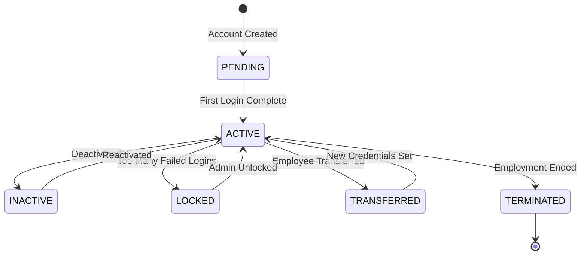

---

## Weapon Assignment Workflow

### Weapon Status States

```text
┌─────────────────────────────────────────────────────────────────────────┐
│                      WEAPON ASSIGNMENT WORKFLOW                          │
│                                                                          │
│  ┌────────────┐                                                          │
│  │ IN_SERVICE │  Weapon in inventory                                     │
│  └─────┬──────┘                                                          │
│        │                                                                 │
│        ▼                                                                 │
│  ┌────────────┐                                                          │
│  │  ASSIGNED  │  Assigned to employee                                    │
│  └─────┬──────┘                                                          │
│        │                                                                 │
│        ├──────────────────┬──────────────────┐                           │
│        │                  │                  │                           │
│        ▼                  ▼                  ▼                           │
│  ┌────────────┐    ┌────────────┐    ┌────────────┐                      │
│  │ IN_SERVICE │    │IN_MAINTENANCE   │    LOST    │                      │
│  │ (Returned) │    └────────────┘    └────────────┘                      │
│  └────────────┘                                                          │
│                            │                                             │
│                            ▼                                             │
│                    ┌────────────────┐                                    │
│                    │ DECOMMISSIONED │                                    │
│                    └────────────────┘                                    │
│                                                                          │
│                    ┌────────────────┐                                    │
│                    │    STOLEN      │                                    │
│                    └────────────────┘                                    │
└─────────────────────────────────────────────────────────────────────────┘
```

### Mermaid Diagram

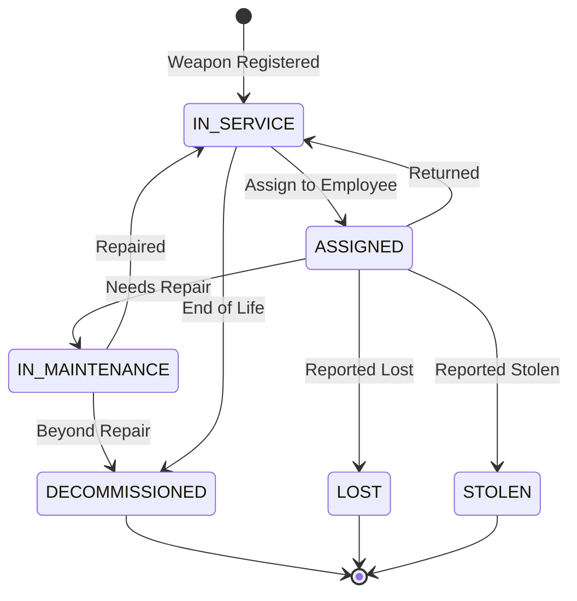

---

## Committee Member Term Workflow

### Term Status States

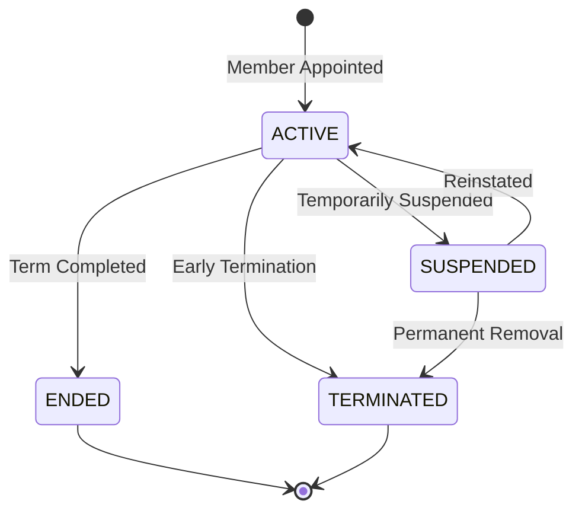

---

## Summary of All Statuses

| Entity | Status Enum | States |
|--------|-------------|--------|
| Employee | `EmployeeStatus` | ACTIVE, INACTIVE, ON_LEAVE, SUSPENDED, RETIRED, TERMINATED, DECEASED |
| User | `UserStatus` | ACTIVE, INACTIVE, LOCKED, PENDING, TRANSFERRED, TERMINATED |
| Transfer | `TransferStatus` | PENDING, ACCEPTED, REJECTED, CANCELLED |
| Leave | `LeaveRequestStatus` | DRAFT, PENDING, APPROVED, REJECTED, CANCELLED |
| Complaint | `ComplaintStatus` | SUBMITTED, UNDER_REVIEW, INVESTIGATION_IN_PROGRESS, etc. |
| Investigation | `InvestigationStatus` | NOT_STARTED, IN_PROGRESS, COMPLETED_CLEARED, COMPLETED_GUILTY, SUSPENDED |
| Retirement | `RetirementStatus` | PENDING, IN_PROGRESS, CLEARANCE, COMPLETED, CANCELLED |
| Clearance | `ClearanceStatus` | PENDING, CLEARED, ISSUES, WAIVED |
| ServiceReward | `ServiceRewardStatus` | PENDING, ELIGIBLE, INELIGIBLE, POSTPONED, AWAITING_APPROVAL, APPROVED, REJECTED, AWARDED |
| Photo | `PhotoStatus` | PENDING_APPROVAL, APPROVED, REJECTED, ACTIVE, ARCHIVED |
| Appraisal | `AppraisalStatus` | DRAFT, IN_PROGRESS, SUBMITTED, REVIEWED, APPROVED, REJECTED |
| Weapon | `WeaponStatus` | IN_SERVICE, ASSIGNED, IN_MAINTENANCE, DECOMMISSIONED, LOST, STOLEN |
| TermStatus | `TermStatus` | ACTIVE, ENDED, TERMINATED, SUSPENDED |

---

## Related Documentation

- [DATA-FLOW.md](./DATA-FLOW.md) - How data moves through system
- [BUSINESS-RULES.md](../business/BUSINESS-RULES.md) - Business rules for transitions
- [API-REFERENCE.md](../reference/API-REFERENCE.md) - API endpoints for status changes

---

*Last Updated: 2025-01-18*
